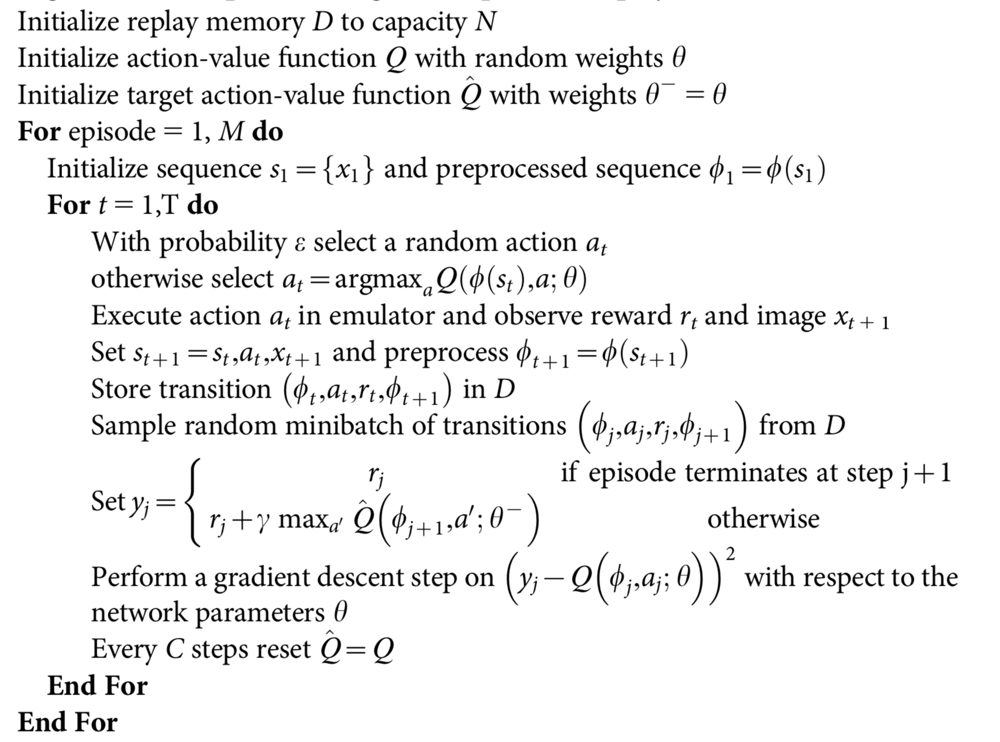
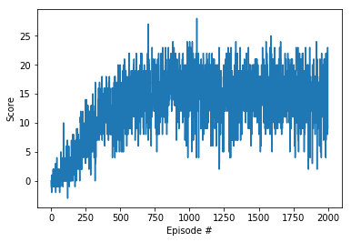

# Project report

## Learning algorithm

The learning algorithm used is Deep Q Learning as implemented in DQL exercise.
Here is this algorithm from [original article](https://storage.googleapis.com/deepmind-media/dqn/DQNNaturePaper.pdf):



## Algorithm parameters

As an input the vector of state is used instead of an image so convolutional neural nework is replaced with fully connected neural network. The neural network has following layers:

- Fully connected layer - input: 37 (state size) output: 64
- Fully connected layer - input: 64 output 64
- Fully connected layer - input: 64 output: (action size)

Parameters used in DQN algorithm:

- Maximum steps per episode: 1000
- Starting epsilion: 1.0
- Ending epsilion: 0.01
- Epsilion decay rate: 0.995

## Some moments

In the training process was added a trigger: every 100 episodes average score is printed and compared with trigger (previous average) score. If current score is bigger than trigger score, model weights are being saved and trigger score is updated.

## Results

Plot:



Log:

```
Episode 100	Average Score: 0.57

Environment triggered!	Average Score: 0.57
Episode 200	Average Score: 3.18

Environment triggered!	Average Score: 3.18
Episode 300	Average Score: 7.72

Environment triggered!	Average Score: 7.72
Episode 400	Average Score: 10.71

Environment triggered!	Average Score: 10.71
Episode 500	Average Score: 12.16

Environment triggered!	Average Score: 12.16
Episode 600	Average Score: 14.00

Environment triggered!	Average Score: 14.00
Episode 700	Average Score: 15.10

Environment triggered!	Average Score: 15.10
Episode 800	Average Score: 15.35

Environment triggered!	Average Score: 15.35
Episode 900	Average Score: 16.17

Environment triggered!	Average Score: 16.17
Episode 1000	Average Score: 15.66

Episode 1100	Average Score: 16.21

Environment triggered!	Average Score: 16.21

Episode 1200	Average Score: 15.44

Episode 1300	Average Score: 14.81

Episode 1400	Average Score: 15.19

Episode 1500	Average Score: 15.63

Episode 1600	Average Score: 15.86

Episode 1700	Average Score: 15.33

Episode 1800	Average Score: 15.04

Episode 1900	Average Score: 14.83

Episode 2000	Average Score: 14.61
```

## Ideas for future work

1. Double Deep Q Networks
    - Q-learning can be overoptimistic in large-scale problems, even if these are deterministic, due to the inherent estimation errors of learning
    - Double Q-learning can be used at scale to successfully reduce this overoptimism, resulting in more stable and reliable learning
2. Prioritized Experience Replay
    - can make learning from experience replay more efficient
    - prioritized replay could speed up learning by a factor 2 and leads to a new state-of-the-art of performance
3. Dueling DQN
    - decouples value and advantage in deep Q-networks, while sharing a common feature learning module
    - could lead to dramatic improvements over existing approaches for deep RL 
4. RAINBOW
    - Combines all previous improvements 
5. Learning from pixels
    - Could bring ability to train on any task